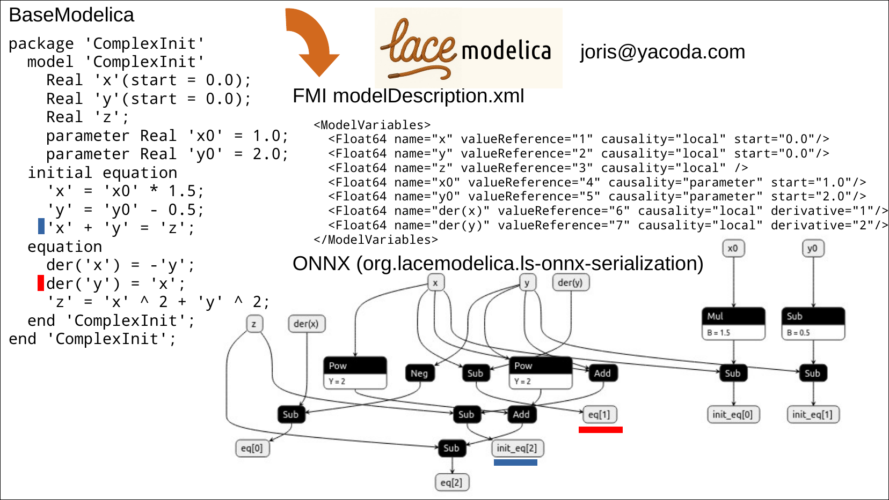
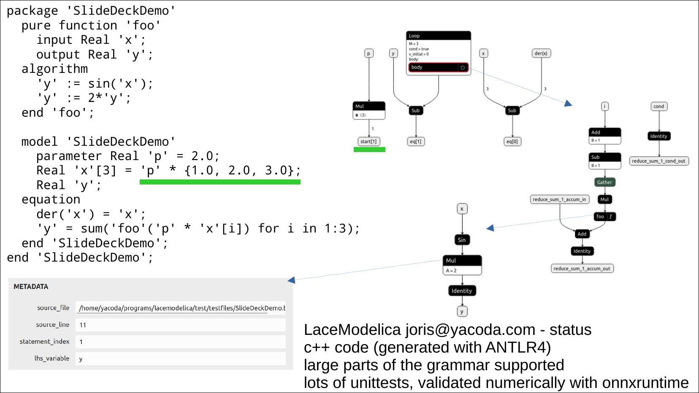

# lacemodelica

A C++17 parser and compiler for BaseModelica that generates Model-Exchange Functional Mock-up Units (FMU v3.0) with symbolic representations in ONNX format.

[](https://opensource.org/licenses/MIT)

### Idea in two slides





## Features

- **BaseModelica Parser**: Full ANTLR4-based parser for BaseModelica language
- **FMU Generation**: Target output format for Functional Mock-up Units
- **ONNX Symbolic Representation**: Layered standard for symbolic math
- **C++17**: Modern C++ implementation with minimal dependencies

## Installation

### Prerequisites

- CMake 3.14 or higher
- C++17 compatible compiler (GCC 11+, Clang 10+, MSVC 2019+)
- Internet connection (for downloading ANTLR4 runtime)

### Building from Source

```bash
git clone https://github.com/yourusername/lacemodelica.git
cd lacemodelica
mkdir build && cd build
cmake ..
make -j4
```

The executable will be available at `build/lacemodelica`.

### Developer Build (Regenerating Parser)

If you modify the grammar file, regenerate the parser with:

```bash
cmake -DREGENERATE_PARSER=ON ..
make -j4
```

**Note**: Parser regeneration requires Java (for ANTLR4 JAR).

## Usage

### Parse All Test Files

```bash
./build/lacemodelica
```

### Parse a Specific File

```bash
./build/lacemodelica path/to/model.bmo
```

### Example

```bash
./build/lacemodelica_exe test/testfiles/MinimalValid.bmo --output-dir output/MinimalValid_fmu
```

Output:
```
lacemodelica - BaseModelica to FMU/ONNX converter
Processing: test/testfiles/MinimalValid.bmo -> output/MinimalValid_fmu
Generated: output/MinimalValid_fmu/modelDescription.xml
Done.
```

## C API

The shared library exposes a C API for easy integration from any language with C FFI support.

### Header

```c
#include <lacemodelica.h>
```

### Functions

```c
// Process a BMO file and generate FMU with ONNX layered standard
// output_dir is required and specifies where modelDescription.xml will be written
lacemodelica_status_t lacemodelica_process_bmo(const char* input_file, const char* output_dir);

// Parse a BMO file without generating output (validation only)
lacemodelica_status_t lacemodelica_parse_bmo(const char* input_file);

// Get human-readable error message
const char* lacemodelica_status_string(lacemodelica_status_t status);
```

### Status Codes

| Code | Description |
|------|-------------|
| `LACEMODELICA_SUCCESS` | Operation completed successfully |
| `LACEMODELICA_ERROR_FILE_NOT_FOUND` | Input file not found |
| `LACEMODELICA_ERROR_PARSE_FAILED` | Parsing failed (syntax error) |
| `LACEMODELICA_ERROR_FMU_GENERATION_FAILED` | FMU generation failed |
| `LACEMODELICA_ERROR_ONNX_GENERATION_FAILED` | ONNX generation failed |
| `LACEMODELICA_ERROR_OUTPUT_DIR_CREATION_FAILED` | Could not create output directory |

### Example

```c
#include <stdio.h>
#include <lacemodelica.h>

int main() {
    lacemodelica_status_t status = lacemodelica_process_bmo("model.bmo", "model_fmu");
    if (status != LACEMODELICA_SUCCESS) {
        fprintf(stderr, "Error: %s\n", lacemodelica_status_string(status));
        return 1;
    }
    return 0;
}
```

## ONNX Output Structure

The generated ONNX model represents the mathematical equations of a Modelica model as a computational graph. The model has multiple outputs representing different aspects of the equation system.

### Output Categories

| Category | Format | Description |
|----------|--------|-------------|
| **Equation Residuals** | `eq[N]` | Residuals for equations in the `equation` section |
| **Initial Equations** | `init_eq[N]` | Residuals for equations in the `initial equation` section |
| **Start Values** | `start[N]` | Initial/default values for variables |
| **Bounds** | `min[N]`, `max[N]` | Variable bounds (only for non-constant expressions) |

### Equation Residuals (`eq[N]`, `init_eq[N]`)

For each equation of the form `lhs = rhs`, the output computes the **residual**: `lhs - rhs`. At the solution, all residuals should equal zero.

**Example** - Given this Modelica model:

```modelica
model 'NewtonCoolingBase'
  parameter Real 'T_inf' = 25.0;
  parameter Real 'T0' = 90.0;
  parameter Real 'h' = 0.7;
  parameter Real 'A' = 1.0;
  parameter Real 'm' = 0.1;
  parameter Real 'c_p' = 1.2;
  Real 'T';
initial equation
  'T' = 'T0';
equation
  'm' * 'c_p' * der('T') = 'h' * 'A' * ('T_inf' - 'T');
end 'NewtonCoolingBase';
```

The ONNX model will have these outputs:

| Output | Represents | Computed As |
|--------|------------|-------------|
| `eq[0]` | Cooling equation residual | `m * c_p * der(T) - h * A * (T_inf - T)` |
| `init_eq[0]` | Initial condition residual | `T - T0` |
| `start[0]` | Initial value of T | `T0` |

### Interpretation

- **Inputs**: All model variables (states, derivatives, parameters) are inputs to the ONNX graph
- **Outputs**: Equation residuals that should all be zero when the system is correctly solved
- **Solver usage**: A numerical solver can use this representation to find values that make all residuals zero

### Testing with ONNX Runtime

You can validate the ONNX output using Python:

```bash
python test/test_onnx_runtime.py
```

This runs the generated ONNX models against reference Python implementations embedded in the `.bmo` test files.

## Project Structure

```
lacemodelica/
├── CMakeLists.txt          # Build configuration
├── LICENSE                 # MIT license
├── README.md              # This file
├── src/
│   └── main.cpp           # Main parser implementation
├── include/               # Header files
├── grammar/
│   └── BaseModelica.g4    # ANTLR4 grammar (from BaseModelica.jl)
├── generated/             # Generated parser code (committed)
│   ├── BaseModelicaLexer.cpp
│   ├── BaseModelicaLexer.h
│   ├── BaseModelicaParser.cpp
│   └── BaseModelicaParser.h
└── test/
    └── testfiles/         # Test suite from BaseModelica.jl
```

## Development Status

🚧 **Early Development** - Currently implements:

- ✅ BaseModelica parsing (12/12 test files passing)
- ✅ ANTLR4 integration with C++ runtime
- ✅ Error reporting and validation
- 🚧 FMU generation (planned)
- 🚧 ONNX symbolic output (planned)

## Testing

The project includes 12 test files from the [BaseModelica.jl](https://github.com/SciML/BaseModelica.jl) repository:

```bash
cd build
./lacemodelica
```

All tests currently pass with successful parsing.

## Dependencies

### Runtime Dependencies

- ANTLR4 C++ Runtime 4.13.2 (automatically fetched via CMake)
- TinyXML-2 10.0.0 (automatically fetched via CMake)

### Build Dependencies

- CMake 3.14+
- C++17 compiler
- Java (only for regenerating parser from grammar)

## License

This project is licensed under the MIT License - see the [LICENSE](LICENSE) file for details.

### Third-Party Components

- **BaseModelica Grammar**: Copyright (c) 2024 Jadon Clugston (MIT License)
  - Source: https://github.com/SciML/BaseModelica.jl
- **ANTLR4**: Copyright (c) 2012-2024 The ANTLR Project (BSD-3-Clause License)
- **TinyXML-2**: Copyright (c) Lee Thomason (Zlib License)

## Contributing

Contributions are welcome! Please feel free to submit a Pull Request.

### Development Setup

1. Fork the repository
2. Create a feature branch (`git checkout -b feature/amazing-feature`)
3. Make your changes
4. Run tests (`./build/lacemodelica`)
5. Commit your changes (`git commit -m 'Add amazing feature'`)
6. Push to the branch (`git push origin feature/amazing-feature`)
7. Open a Pull Request

## Integrations

### CasADi

LaceModelica can be used as a plugin for [CasADi](https://web.casadi.org/)'s DaeBuilder to load BaseModelica models directly:

- **Nightly builds**: [nightly-lacemodelica](https://github.com/casadi/casadi/releases/tag/nightly-lacemodelica)
- **Source branch**: [casadi/casadi:lacemodelica](https://github.com/casadi/casadi/tree/lacemodelica)
- **Unit tests**: [test_basemodelica](https://github.com/casadi/casadi/blob/c94f17e74f048fba5c2470a6fdff6ee3a0410b7b/test/python/daebuilder.py#L1408-L1432)

## Acknowledgments

- [BaseModelica.jl](https://github.com/SciML/BaseModelica.jl) - Grammar and test files
- [ANTLR4](https://www.antlr.org/) - Parser generator
- [SciML](https://sciml.ai/) - Scientific machine learning ecosystem

## Contact

**Joris Gillis** - YACODA

Project Link: [https://github.com/yacoda/lacemodelica](https://github.com/yacoda/lacemodelica)

## Roadmap

- [ ] Complete FMU generation
- [ ] ONNX symbolic representation layer
- [ ] Optimization passes
- [ ] Documentation and examples
- [ ] CI/CD pipeline
- [ ] Package manager integration (vcpkg, conan)
